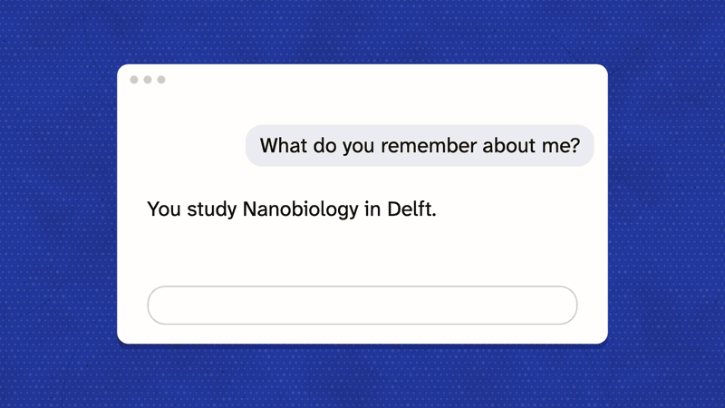
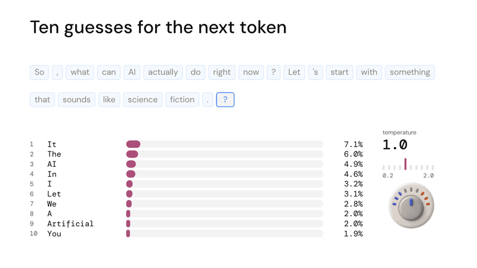
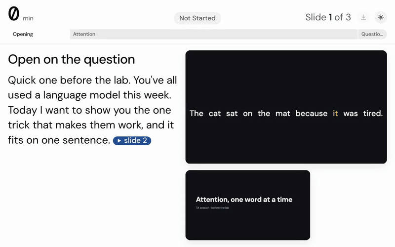

# presentation

An agent skill that directs, builds and publishes a talk you give live: a web app paced like a film, where each click advances one beat of a continuous scene, published at a link you present from.

You describe the talk. The agent interviews you, gathers references, writes the story and script, shows you a storyboard and style frames, builds the talk, tests it, and hands you a link.

## Examples



*A lecture on context windows: the chat you see, then everything the model reads. [Watch the talk](https://guy915.github.io/nb2410-context/)*



*A lecture on how language models work: next-token sampling, with the temperature turned down and up. [Watch the talk](https://guy915.github.io/llm-website-slides-deck/)*



*The speaker view: each beat's cue and script, the next and current slides, and your pace against the plan.*

## What you get

- **A talk at a link,** self-hosted, with every asset bundled; it runs from a laptop or offline.
- **A speaker view** with each beat's cue and full script, the next slide, the time since the start and your pace against the plan.
- **Clicker-only presenting:** next and back drive everything, demos included.
- **A tested build:** reversible beats, a readable type floor, contrast, glance limits and smooth motion, checked by the runtime's suite.
- **A rehearsal timer** that corrects the plan to your real pace, and a handout PDF.

## Install

**Claude Code (plugin):**

```text
/plugin marketplace add guy915/presentation-skill
/plugin install presentation@presentation-skill
```

**Any agent that reads skills** (Claude Code, Codex, Cursor and others):

```text
npx skills add guy915/presentation-skill
```

**Claude apps:** download this repository, zip `skills/presentation/`, and upload it as a skill.

## Requirements

Node 22.18 or newer, Chromium for Playwright (`npx playwright install chromium`) and ffmpeg. For clips, yt-dlp. For publishing to GitHub Pages, the GitHub CLI (`gh`).

## Make it yours

`skills/presentation/references/defaults.md` holds one owner's choices: the controls, the host, the image generator, the 3D tools and the project folder. Edit it for your setup; the rest of the skill reads its choices from there.

## How it works

1. **Brief:** a short interview, then the request is kept verbatim as a ledger of asks.
2. **Storyboard:** gather references (inspiration, sources, assets), write the story and script, and show a placeholder deck. Checkpoint 1.
3. **Research and look:** verify every claim, fetch the material, and render style directions. Checkpoint 2.
4. **Build:** set pieces first, then the rest, on a small runtime (Vite, TypeScript, GSAP).
5. **QA:** the full test suite, one independent review, one critique pass.
6. **Release:** publish, check the link, and send a short message on how to present.

Talks of 5 minutes or less use one combined checkpoint.

## Privacy

The skill collects no personal data and has no telemetry. The talk and its sources stay in a project folder on your machine. Data leaves it only for services your talk uses: the host you publish to (GitHub Pages by default, via `gh`), media you choose to fetch (yt-dlp), and the image generator set in `defaults.md`, each under your own account.

## Licence

MIT. The bundled DM Sans and DM Mono fonts are under the SIL Open Font License 1.1.
